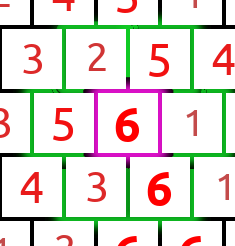

# Introduction

### Setup:

The game has a board with 67 filed where has a valence. The valence is between 1 and 6.

### Goal:

The goal of the game is to get more points as your opponent. You get points when you capture a field. The points you get is the valence that is written on the field.

### Rounds:

The green player starts the game and then you switch your turn. In each turn you can select a field where you put your figure. The green player has a green rectangle and the blue player a blue circle. 

### Capture a field:

Each field has between 2 and 6 neighbors. To capture a field you need to put your figure 50% on the field plus it's neighbors.
The purple marked field has 6 neighbors. 

 

To capture the purple field you need your figure on 4 fields of the neighbor and the field itself. The green player has 3 of these fields and needs just one more to capture the purple field. 

Now the green player selected a fourth field and captured the purple field. 

### End:

The end of the game is reached when all fields are captured. 
